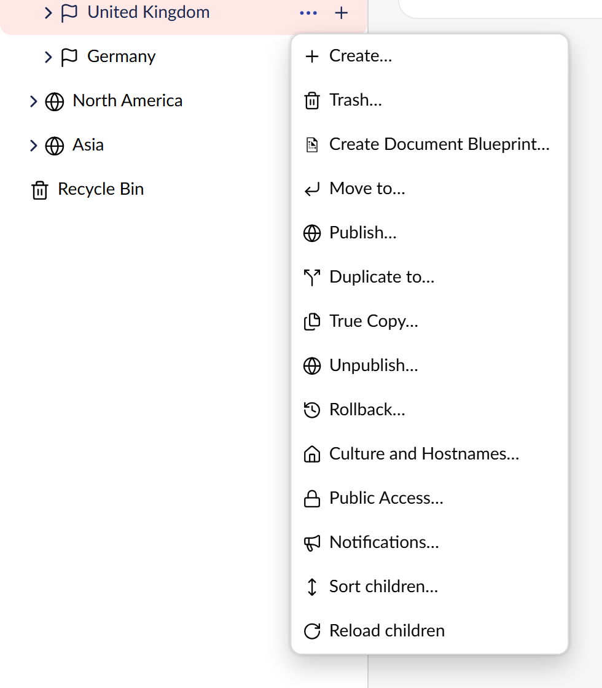

# TrueCopy for Umbraco

**Copy a section of your site and have the links come with it.**

[](https://www.nuget.org/packages/Our.Umbraco.TrueCopy)
[](https://github.com/SteveVaneeckhout/Our.Umbraco.TrueCopy)

Umbraco's built-in Copy leaves every internal link in the copies pointing at the originals.
TrueCopy performs the same copy, then repoints every link whose target was part of the copy — and
lists the ones that still point outside it, which is the thing an editor cannot see for themselves.
Custom property editors are supported by implementing one interface.

```bash
dotnet add package Our.Umbraco.TrueCopy
```

Requires Umbraco 18 and .NET 10. On the **Umbraco 17 LTS**, install the 17.x line instead - the
package major follows the Umbraco major:

```bash
dotnet add package Our.Umbraco.TrueCopy --version "17.*"
```



## Documentation

- [Development setup](development.md)
- [How it works](architecture.md)
- [Writing your own rewriter](extending.md)
- [Full README](https://github.com/SteveVaneeckhout/Our.Umbraco.TrueCopy#readme)
- [Changelog](https://github.com/SteveVaneeckhout/Our.Umbraco.TrueCopy/blob/main/CHANGELOG.md)
- [Report an issue](https://github.com/SteveVaneeckhout/Our.Umbraco.TrueCopy/issues)

---

MIT licensed. Part of a set of three Umbraco 18 packages:
[Content Dashboard for Umbraco](https://github.com/SteveVaneeckhout/Our.Umbraco.ContentDashboard) · [Error Dashboard for Umbraco](https://github.com/SteveVaneeckhout/Our.Umbraco.ErrorDashboard) · **TrueCopy for Umbraco** (this one)
